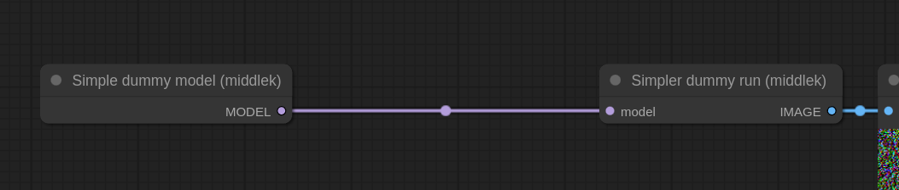
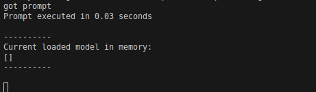
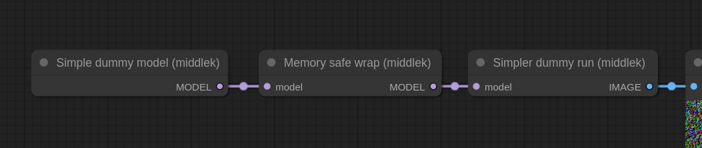
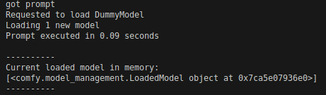

# 🎨 ComfyUI-mem-safe-wrapper

Load된 모델을 ComfyUI에서 Smart memory management를 가능하도록 바꾸는 노드입니다.

## 📌 Index

- [Introduction](#-introduction)
- [Features](#-features)
- [Install](#-install)
- [How to use](#-how-to-use)
- [Contact](#-contact)

## 🚀 Introduction
ComfyUI의 Smart Memory Management는 RAM, GPU 메모리 및 가비지 컬렉션을 효율적으로 관리합니다. 이 기능은 자주 사용되는 모델을 메모리에 유지하여 추론 속도를 높이고, 메모리가 부족할 경우 덜 중요한 모델을 동적으로 해제하여 자원을 최적화합니다.

하지만 **모든 ComfyUI 커스텀 노드 개발자가 Smart memory management가 가능하도록 노드를 개발하지는 않습니다**. 그 중에서 멋진 모델들도 다수 포함됩니다.

Mem-safe-wrapper는 이런 모델 노드를 wrapping하여 ComfyUI가 Smart memory management를 가능하도록 하는 커스텀 노드입니다.

## 💡 Features
### Memory safe wrap
**`torch.nn.Module`을 상속받은 모델을 input으로** 받아 comfyui의 ModelPatcher로 wrapping합니다. 기존 model의 attribute들은 그대로 사용할 수 있습니다.

### Reset model patcher
다른 node에서 Modelpatcher의 calculate weight 함수를 injection했다면 오류가 발생하는 custom node가 다수 존재합니다.(ex: comfyui-inpaint-nodes <a href="https://github.com/Acly/comfyui-inpaint-nodes">https://github.com/Acly/comfyui-inpaint-nodes</a>). 이를 원본 Modelpatcher의 calculate weight로 reset하여 문제를 해결하는 노드입니다.


## 📥 Install
```bash
cd {your_comfyui_path}/custom_nodes
git clone {this_repository}
```

## 🖥 How to use
해당 코드를 `main.prompt_worker`에 추가하고 실행한 결과입니다. (사용시 코드를 추가할 필요는 없습니다. 단순 테스트 용도입니다.)
```python
from comfy.model_management import current_loaded_models
print(f"""
----------
Current loaded model in memory:
{current_loaded_models}
----------
""")
```

### Without mem-safe-wrapper


### With mem-safe-wrapper




## 📞 Contact
middlek - middlekcenter@gmail.com
